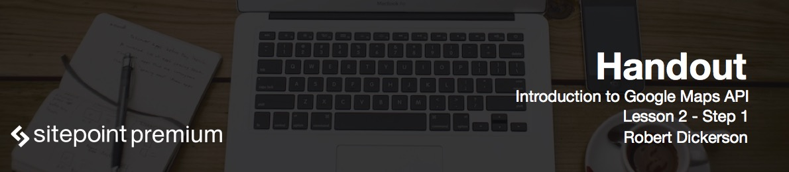

# Introduction

The first step in creating a map is generating an **API key** associated with your Google account. This key allows you to monitor your map's API usage through the Google API console. In this lesson you will learn how to use the Google API console to generate your unique API key. Google Maps JavaScript API does not require you to have a key to function properly, but it is recommended for live production sites. Let's start out by visiting the Google API Console.

# Google API Console

Access Google API Console by visiting [console.developers.google.com](https://console.developers.google.com). Log in with your Google account and you will see your project dashboard. To obtain API key:

* On the left-side menu click on the APIs and Auth.
* Click API's. You will see that now you can browse the different Google API's that are available, enable the ones you are interested in.
* Search for the Google Maps JavaScript API and enable it.
* After you enable the API, you will see three sub menus: **Overview**, **Usage**, and **Quotas**. Usage provides the total number of API requests and responses for your account based on a specified timeline. The quota screen will show you the limits in requests per day and your remaining requests. You'll start out with 25 000 requests per day and one request per second, per user.
* Click Credentials on the left-hand side menu.
* In the Public API Access section click Create New Key button.
* Click the Browser Key button.
* On the next screen you can specify domains that are allowed to make requests using your key to the Google API in order to prevent unauthorized access. For now we will not restrict access to our API key, so just click Create.
* Once your API key has been created you will be able to see the API key, allowed refers, the activation date, and who it was activated by. You now have the option of editing the refers list, regenerate a new key, or delete this key. If you **regenerate** a new key, the old one will be deactivated within 24 hours, therefore you'll have to update any sites that use your key in that time frame.
* Copy your API key. You will need it as we start working with the Google API.