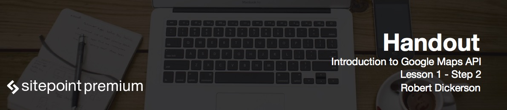

# Getting started

In this lesson we will go through the tools and code samples. To get started, you will need your favorite text editor and a web browser such as Chrome, Firefox, IE, or Safari. I'll be using Brackets, which you can download at [brackets.io](brackets.io), and Chrome browser for the lesson demonstrations.

The code examples for each lesson can be downloaded as a zip file or you can pull down the code on GitHub - there is a separate branch for each lesson, so you can easily check out different lessons as you move through the course. The final course project can be found in the master branch on GitHub, or you can access it live at [learnaboutmaps.com](learnaboutmaps.com). As you go through the course, use the comments section for any questions you have or you can reach out to me directly on Twitter (@robdickersonjr).