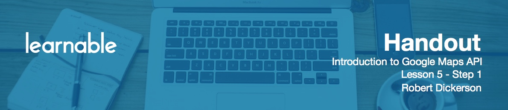

# Introduction

In this lesson we'll learn about the methods to get and set map properties. You will also learn how to create event handlers to interact with map methods, that control map and mouse interactions.

Let's start out by discussing the map methods that you can use to control the map properties themselves. In the basic map options lesson, we learned about configuring the map bypassing map option properties into the map constructor. Google has provided methods for a number of those properties to get and set the property value. In this lesson, you will learn how to apply some of these methods and events in some common examples. I suggest referring to the Google API reference during this lesson to gain a deeper understanding of the methods.

# Getter and setter map methods

The map **get** methods allow you to retrieve the current map settings. 

* `getCenter` returns the current map latitude and longitude center.
* `getZoom` returns the current zoom level.
* `getBounds` which returns the southwest and northeast corner coordinates of the view port. This function is useful if you want to get the boundaries of the user view port.
* `getHeading` returns the compass heading.
* `getMapTypeId` returns the map type and there's four different options: roadmap, satellite, hybrid or terrain, so you can use that to determine the particular base layer that the user is working with.
* `getProjection` returns the current projection.
* `getStreetView` returns the default street view panorama that's currently bound to the map.
* `getTilt` returns the tilt angle of the imagery whether it's zero or 45 degrees.

The map set methods allow you to set the map properties. Their names begin with the word `set` and they are similar to the get method we just discussed (for example, `setCenter` or `setZoom`).

# Understanding Map events

Next set of methods allows you to seamlessly pan and fit the map within a given viewport based on an X and Y pixel value, a latitude and longitude or a set of coordinate bounds. These functions are useful to initiate transitions on the map, to pan to a new location based on a user's selection.

With mouse map events, you create callbacks based on mouse events that occur on the map canvas. These events include clicking, double clicking, mouse movement, enter and exiting the map container, and right clicking on the map. With mouse events the callback receives the mouse event object. This object contains the latitude and longitude coordinates where the mouse event occurred.

Map changed events represent listeners that are fired on changes to the map. These events can be associated with the changes to the bounds, center, heading, map type ID, projection, tilt, and zoom. These listeners are useful to respond to changes based on user interaction with the map.

Finally there are methods that represent interactions with the map canvas, container, are fired upon the completion of an event. The drag events are fired when the user clicks and drags on the map to start, end, or you can set it to fire repeatedly by calling drag. The idle event is fired after panning or zooming is complete, and the resize event is triggered on the resize of the map container such as when your browser size changes. Finally the tiles loaded fires once the map base layer tiles have completed loading.

# Create event handlers

Let's look at some examples.

For the first example, as the user moves their mouse around the map, I want to display the latitude and longitude of the mouse cursor, and the position it is on the map. Add a new `div` block:

```html
<div id="ltlgcoords">
  <span>lat</span>
  <span id="latcoords"></span>
  <span>lon</span>
  <span id="loncoords"></span>
</div>
```

Set some styles:

```css
#ltlgcoords {
  position: fixed;
  bottom: 25px;
  left: 250px;
  width: 500px;
  font-family: Roboto, Arial, sans-serif;
  font-size: 20px;
  color: black;
  border: 2px solid black;
  background: rgb(245, 245, 245);
  background: rgba(245, 245, 245, .9);
}

#ltlgcoords span {
  margin: 0 5px 0 5px;
}
```

Add some global variables that will just get the element of the latitude and longitude coordinates.

```js
var lat = document.getElementById('latcoords');
var lng = document.getElementById('loncoords');
```

Add a function that will take a lat and long location and update our `div`:

```js
function updateCurrentLatLng(latLng) {
    lat.innerHTML = latLng.lat();
    lng.innerHTML = latLng.lng();
}
```

`latLng` is a Google Maps object that we're going to pass in.

On first load we want to update this position, so add this line to the end of the `loadMap` function:

```js
updateCurrentLatLng(map.getCenter());
```

Now we're going to create a function that handles all the map event listeners and call it `mapEventListeners`:

```js
function mapEventListeners() {
  var mouseMoveChanged = google.maps.event.addListener(map, 'mousemove',
      function (event) {
        updateCurrentLatLng(event.latLng);
      }
  );
}
```

So when the mouse is moved this function gets called. The `event` contains the latitude, the current latitude and longitude of the mouse.

Add another line to the end of `loadMap`:

```js
mapEventListeners();
```

The next example involves showing an alert when the map finishes loading. So let's add some code in the `mapEventListeners`:

```js
var listenerIdle = google.maps.event.addListenerOnce(map, 'idle',
    function() {
      alert('Map is ready!');
    }
);
```

This event listener will only get called once because we've used `addListenerOnce` method insead of `addListener`. It'll show an alert that says the map is ready.

The third example we're going to talk about is we're going to update the URL with the current latitude, longitude, and zoom of the map center. This is usual if you want to create a URL that the user can copy and paste, and then come back for the same location they were looking at before. To update the URL, we're going to take advantage of the HTML5 History Push State API to re-write URL without actually calling a refresh of the browser:

```js
function updateUrlLocation(center, zoom) {
  var url = '?lat='+center.lat()+'&lon='+center.lng()+'&zoom='+zoom;
  window.history.pushState({center: center, zoom: zoom }, 'map center', url);
}
```

This function takes the center point in the zoom, and it creates a URL that contains the latitude, longitude and zoom.

In the `mapEventListeners` we want to add two additional listeners that will help us update this URL. The first one is `dragEnd`:

```js
var listenerDragEnd = google.maps.event.addListener(map, 'dragend',
    function() {
      updateUrlLocation(map.getCenter(), map.getZoom());
    }
);
```

This event fires when a user stop panning the map and release the mouse.

```js
var listenerZoomChanged = google.maps.event.addListener(map, 'zoom_changed',
    function() {
      updateUrlLocation(map.getCenter(), map.getZoom());
    }
);
```

The same principle applies to `zoom_changed` event, that fires whenever user finished zooming the map.

We also want to call this function when the map is loaded, to add another line to the end of `loadMap`:

```js
updateUrlLocation(map.getCenter(), map.getZoom());
```

For the last example, we want to use the right click to set the map center location and increment the zoom level. This is similar to double clicking on the map to zoom into the next level. But what we want to do is to zoom in to a certain extent.

Add an event listener for the right click:

```js
var mouseRightClick = google.maps.event.addListener(map, 'rightclick',
    function(event) {
      var z = map.getZoom()+1;
      
      if(z < 16) {
        map.setZoom(z);
      }
      else {
        map.setZoom(11);
      }
      
      map.setCenter(event.latLng);
    }
);
```

When a user double clicks on the map, keep zooming in until you reach the zoom limit, and then reset back to zoom level 11. We also set the map center based on the location of the right click on the map by using `setCenter` function.