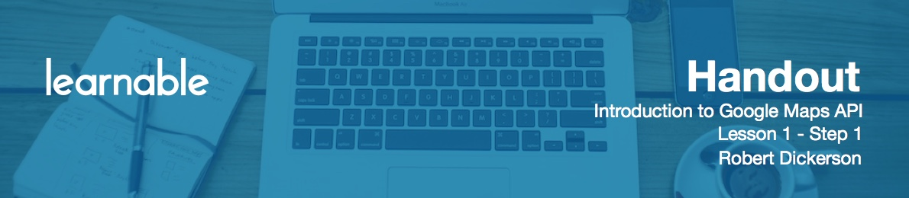

# Introduction

Hello and welcome to Introduction to the Google Maps JavaScript API course! My name is Robert Dickerson. In this course, we will start with the basics of getting the Google Maps set up, and getting a solid understanding of the JavaScript API. You learn how to interact and control the map, how to style it, use custom colors, add marker overlays withc ustom icons, handle mouse events when clicking on an icon, and create customized info windows that pop up when markers are clicked.

Once you've mastered the basics, the lessons will start to build on each other in the creation of our course project. We'll be creating an interactive visualization of U.S. airport arrival and departure times with a number of techniques to enhance visualization, so users can quickly find the information of interest, and spot trends in the data. I've created a website for the final course project we will be building - you can check it out at [learnaboutmaps.com](http://learnaboutmaps.com).

# What is API

Throughout the course, we'll refer to the term **API** (**Application Program Interface**). It refers to the classes, methods, properties, and events, that will allow you to interface and control the Google Map. For this course, we'll focus on using the JavaScript API for creating web based maps that can be used across desktop and mobile browsers. Once you've completed this introductory course,you will have a solid understanding of the Google Maps API, as well as a strong foundation to learn more about advanced concepts.

Ready to get started? Then, let's go!

# Index for the Introduction To Google Maps API course

* [Lesson 1.1](Introduction_to_Google_Maps_API_handouts/1-1.md)
* [Lesson 1.2](Introduction_to_Google_Maps_API_handouts/1-2.md)
* [Lesson 2.1](Introduction_to_Google_Maps_API_handouts/2-1.md)
* [Lesson 2.2](Introduction_to_Google_Maps_API_handouts/2-2.md)
* [Lesson 2.3](Introduction_to_Google_Maps_API_handouts/2-3.md)
* [Lesson 2.4](Introduction_to_Google_Maps_API_handouts/2-4.md)
* [Lesson 3.1](Introduction_to_Google_Maps_API_handouts/3-1.md)
* [Lesson 4.1](Introduction_to_Google_Maps_API_handouts/4-1.md)
* [Lesson 4.2](Introduction_to_Google_Maps_API_handouts/4-2.md)
* [Lesson 5.1](Introduction_to_Google_Maps_API_handouts/5-1.md)
* [Lesson 6.1](Introduction_to_Google_Maps_API_handouts/6-1.md)
* [Lesson 6.2](Introduction_to_Google_Maps_API_handouts/6-2.md)
* [Lesson 6.3](Introduction_to_Google_Maps_API_handouts/6-3.md)
* [Lesson 7.1](Introduction_to_Google_Maps_API_handouts/7-1.md)
* [Lesson 7.2](Introduction_to_Google_Maps_API_handouts/7-2.md)
* [Lesson 7.3](Introduction_to_Google_Maps_API_handouts/7-3.md)
* [Lesson 8.1](Introduction_to_Google_Maps_API_handouts/8-1.md)

